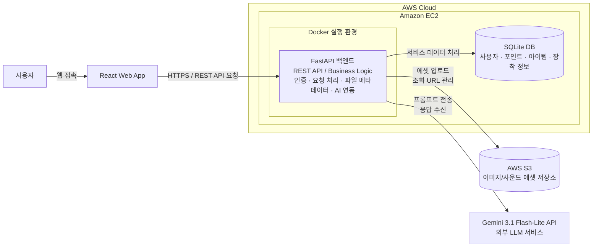
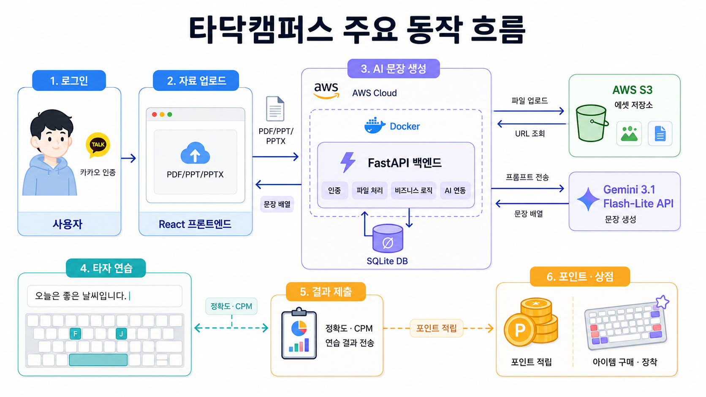

# 타닥캠퍼스 최종 보고서

> 클라우드컴퓨팅 텀 프로젝트 최종 보고서  
> PDF/PPT 학습 자료를 AI 기반 타자 연습 문장으로 변환하고, 연습 결과를 포인트와 상점 보상으로 연결하는 클라우드 기반 웹 타자 학습 서비스

**서비스 링크**

| 구분 | URL |
| --- | --- |
| 배포 서비스 | https://tadak.redzzzi.com |

## 목차

- [A. 프로젝트 명](#a-프로젝트-명)
- [B. 프로젝트 멤버 이름 및 멤버별 담당 파트](#b-프로젝트-멤버-이름-및-멤버별-담당-파트)
- [C. 프로젝트 소개](#c-프로젝트-소개)
- [D. 프로젝트 필요성](#d-프로젝트-필요성)
- [E. 관련 기술 / 논문 / 특허 조사 내용](#e-관련-기술--논문--특허-조사-내용)
- [F. 프로젝트 개발 결과물 소개](#f-프로젝트-개발-결과물-소개)
- [G. 개발 결과물을 사용하는 방법](#g-개발-결과물을-사용하는-방법)
- [H. 개발 결과물의 활용방안](#h-개발-결과물의-활용방안)
- [I. AI 활용](#i-ai-활용)

## A. 프로젝트 명

**타닥캠퍼스(Tadak Campus)**

**타닥캠퍼스**는 사용자가 업로드한 학습 자료에서 핵심 문장을 생성하고, 이를 직접 타이핑하며 학습 및 복습할 수 있도록 돕는 웹 기반 학습형 타자 연습 서비스입니다.
타자 연습 후 포인트를 제공하고 이를 상점에서 아이템 구매에 활용할 수 있도록 하여, 반복 학습에 대한 동기를 부여합니다.
<div width="100%" align="right">
 
</div>

## B. 프로젝트 멤버 이름 및 멤버별 담당 파트

| 이름   | 역할 | 담당 파트                            | 주요 수행 내용                                                                                                                                    |
| ------ | ---- | ------------------------------------ | ------------------------------------------------------------------------------------------------------------------------------------------------- |
| 이시웅 | 팀장 | 백엔드/API 및 클라우드 인프라        | 프로젝트 진행 관리, FastAPI 백엔드 구조 설계, REST API 구현, AWS EC2/Docker 기반 배포 준비, SQLite/S3/Gemini API 연동 구조 설계                   |
| 한대희 | 팀원 | 프론트엔드 기능 및 키보드 인터페이스 | 타자 연습 화면, 키보드 시각화, 상점 화면, 아이템 미리보기/장착 UI, 타자 효과음 및 웹 콘텐츠 구성                                                  |
| 홍지연 | 팀원 | 프론트엔드 UI 및 AWS Amplify 배포    | 서비스 전체 UI 방향성 정립, 디자인 시스템 구축, 홈 화면과 소셜 로그인 UI 구현, AWS Amplify를 이용한 프론트엔드 배포, 도메인 연결 및 환경변수 설정 |

## C. 프로젝트 소개

### 1. 프로젝트 개요

타닥캠퍼스는 강의자료, 시험 대비 요약본, 개인 학습 자료처럼 PDF/PPT/PPTX 형태로 보관된 문서를 타자 연습 콘텐츠로 바꾸는 서비스입니다. 사용자는 웹 브라우저에서 파일을 업로드하고, 백엔드는 자료의 텍스트를 기반으로 타이핑하기 적합한 문장 배열을 생성합니다. 생성된 문장은 프론트엔드에 전달되어 타자 연습 세트로 사용됩니다.

서비스의 목표는 단순히 자료를 읽는 학습을 넘어, 사용자가 직접 핵심 문장을 입력하면서 내용을 반복적으로 확인하도록 만드는 것입니다. 연습 완료 후에는 정확도, 타자 속도(CPM), 오타 수, 소요 시간 등의 결과를 확인할 수 있고, 결과에 따라 포인트를 획득합니다. 획득한 포인트는 상점에서 키보드, 배경, 사운드, 꾸미기 아이템을 구매하고 장착하는 데 활용됩니다.

### 2. 주요 기능

| 기능                | 설명                                                                                                                       |
| ------------------- | -------------------------------------------------------------------------------------------------------------------------- |
| 학습 자료 업로드    | 홈 화면에서 PDF/PPT/PPTX 파일을 업로드합니다. 프론트엔드는 최대 50MB 파일을 검증한 뒤 백엔드의 문장 생성 API로 전송합니다. |
| AI 맞춤 문장 생성   | 백엔드는 업로드 자료의 텍스트를 추출하고 외부 LLM API와 연동하여 타자 연습용 문장 배열을 생성합니다.                       |
| 단문 타자 연습      | 생성된 문장 또는 기본 문장을 차례대로 입력하며 정확도, CPM, 오타 수, 경과 시간을 실시간으로 확인합니다.                    |
| 키보드 시각화       | 사용자가 누르는 키를 화면 키보드에 반영하고, 장착한 키보드 스킨/배경/장식/사운드 효과를 연습 화면에 적용합니다.            |
| 결과 및 포인트 적립 | 연습 완료 시 완료 문장 수, 정확도, 속도를 백엔드로 전송하고 산정된 포인트를 결과 모달로 표시합니다.                        |
| 상점 및 꾸미기      | 포인트로 아이템을 구매하고 키보드, 배경, 사운드, 장식을 미리보기 후 장착할 수 있습니다.                                    |
| 카카오 로그인       | 카카오 OAuth로 로그인한 뒤 백엔드 인증 토큰을 발급받아 사용자 포인트와 장착 아이템 정보를 조회합니다.                      |

### 3. 서비스 대상

- 강의자료나 요약본을 능동적으로 복습하고 싶은 학생
- 반복 입력을 통해 개념 문장을 암기하고 싶은 사용자
- 게임형 보상 요소를 통해 꾸준히 타자 연습을 지속하고 싶은 사용자
- 별도 프로그램 설치 없이 브라우저에서 학습과 타자 연습을 함께 진행하고 싶은 사용자

---

## D. 프로젝트 필요성

기존의 학습 방식은 PDF 강의자료나 요약본을 눈으로 읽는 데 그치는 경우가 많습니다. 이러한 방식은 빠르게 내용을 훑어볼 수 있다는 장점이 있지만, 학습자가 내용을 능동적으로 처리하지 못하면 집중력과 기억 지속성이 떨어질 수 있습니다. 타이핑은 문장을 직접 입력하는 과정이 포함되므로 학습자가 핵심 문장을 한 번 더 인식하고, 오타를 고치며, 반복적으로 내용을 확인하게 만듭니다.

타닥캠퍼스는 다음 필요성을 바탕으로 기획되었습니다.

1. **능동적 복습 경험 제공**  
   업로드한 학습 자료를 단문 연습 세트로 변환하여 사용자가 핵심 문장을 직접 입력하도록 합니다.

2. **즉각적인 학습 피드백 제공**  
   입력 중 정답/오답 상태, 정확도, CPM, 오타 수를 실시간으로 제공하여 사용자가 자신의 연습 상태를 바로 파악할 수 있습니다.

3. **반복 학습 동기 강화**  
   포인트와 상점 아이템을 통해 반복 연습에 대한 보상 구조를 제공하고, 사용자가 자신의 키보드 화면을 꾸미며 서비스에 계속 참여하도록 유도합니다.

4. **웹 기반 접근성 확보**  
   PC와 노트북의 웹 브라우저에서 바로 사용할 수 있어 별도 설치 부담이 낮고, 클라우드 배포를 통해 업데이트와 운영이 쉽습니다.

## E. 관련 기술 / 논문 / 특허 조사 내용

### 1. 선행 서비스 및 관련 기술 조사

| 조사 대상                 | 주요 내용                                                                                                                                                                                                                                               | 타닥캠퍼스 적용 방향                                                                                                                                                                                                                                         |
| ------------------------- | ------------------------------------------------------------------------------------------------------------------------------------------------------------------------------------------------------------------------------------------------------- | ------------------------------------------------------------------------------------------------------------------------------------------------------------------------------------------------------------------------------------------------------------ |
| 한컴타자연습              | 웹 기반으로 자리 연습, 낱말 연습, 단문/장문 연습, 필사, 게임, 퀴즈를 제공하는 대표 타자 연습 서비스입니다. Unity WebGL/WebAssembly 기반 콘텐츠와 사용자 기록 저장 구조를 활용합니다.                                                                    | 웹 환경에서의 실시간 입력 판정, 키보드 시각화, 게임형 보상 요소를 참고했습니다. 타닥캠퍼스는 학습 자료 업로드와 AI 문장 생성을 결합해 학습 목적의 타이핑 연습으로 차별화했습니다.                                                                            |
| React / Vite SPA          | 컴포넌트 기반 UI 개발과 빠른 개발 서버, 정적 빌드에 적합한 프론트엔드 기술입니다.                                                                                                                                                                       | 화면을 홈, 로그인, 연습 메뉴, 타자 연습, 상점으로 분리하고 재사용 가능한 키보드/레이아웃 컴포넌트를 구성했습니다.                                                                                                                                            |
| Tailwind CSS / MUI Icons  | 유틸리티 클래스와 아이콘 컴포넌트를 활용해 일관된 UI를 빠르게 구현할 수 있습니다.                                                                                                                                                                       | 공통 레이아웃, 카드, 버튼, 탭, 키보드 미리보기 화면을 통일된 스타일로 구성했습니다.                                                                                                                                                                          |
| FastAPI / REST API        | Python 기반 비동기 웹 프레임워크로 파일 업로드, 인증, Swagger 문서화, API 서버 구현에 적합합니다.                                                                                                                                                       | 프론트엔드와 백엔드가 `/api` 하위 REST 엔드포인트로 통신하도록 설계했습니다.                                                                                                                                                                                 |
| SQLite                    | MVP 규모의 사용자, 포인트, 아이템, 장착 정보 저장에 적합한 경량 데이터베이스입니다.                                                                                                                                                                     | EC2 내부 백엔드에서 서비스 데이터 처리용 DB로 사용하도록 구성했습니다.                                                                                                                                                                                       |
| AWS Amplify               | Amplify는 GitHub 저장소와 연동하여 프론트엔드 정적 웹 애플리케이션을 자동 빌드/배포할 수 있는 AWS 서비스입니다. 빌드 명령, 배포 브랜치, 환경변수, 커스텀 도메인 연결을 관리할 수 있어 React/Vite 기반 SPA 배포에 적합합니다.                            | 프론트엔드 저장소를 AWS Amplify와 연결하여 React/Vite 빌드 결과물을 배포했습니다. 실제 서비스는 `https://tadak.redzzzi.com` 도메인으로 접속할 수 있으며, Amplify 환경변수에 백엔드 API 주소와 카카오 Redirect URI를 설정했습니다.                            |
| AWS EC2                   | EC2는 AWS에서 제공하는 가상 서버 서비스로, 사용자가 직접 서버 실행 환경을 구성하고 외부 요청을 받을 수 있는 클라우드 컴퓨팅 자원입니다. 인스턴스 타입, 운영체제, 보안 그룹, 포트 설정을 관리하며 백엔드 API 서버를 상시 실행하는 데 활용할 수 있습니다. | FastAPI 백엔드를 실행하는 클라우드 서버 환경으로 EC2를 사용했습니다. 프론트엔드는 배포된 EC2 서버의 API 주소로 요청을 보내고, EC2 내부에서는 인증, 파일 처리, 포인트 계산, 상점 요청 처리 등 서비스의 핵심 백엔드 로직을 수행합니다.                         |
| Docker                    | Docker는 애플리케이션 실행 환경을 컨테이너 단위로 패키징하는 기술입니다. Python 버전, 라이브러리, 실행 명령, 환경변수 구성을 이미지로 표준화할 수 있어 개발 환경과 서버 환경의 차이를 줄이고 배포 과정을 단순화할 수 있습니다.                          | FastAPI 백엔드를 Docker 컨테이너로 실행하도록 설계했습니다. 이를 통해 EC2에 직접 라이브러리를 흩어 설치하는 대신, 백엔드 애플리케이션과 의존성을 하나의 실행 단위로 관리하고 재시작/재배포가 쉬운 구조를 만들었습니다.                                       |
| AWS S3                    | S3는 AWS의 객체 스토리지 서비스로, 이미지, 사운드, 문서 같은 정적 파일을 저장하고 URL을 통해 조회할 수 있습니다. 파일 자체를 서버 디스크나 DB에 직접 저장하는 방식보다 확장성과 관리성이 높고, 정적 에셋 관리에 적합합니다.                             | 상점 아이템의 썸네일, 키보드 배경, 장식 이미지, 타자 효과음 같은 에셋을 S3에 저장하는 구조로 설계했습니다. SQLite DB에는 파일 자체가 아니라 S3 에셋 URL을 저장하고, 프론트엔드는 해당 URL을 이용해 화면 미리보기와 효과음 재생에 필요한 리소스를 불러옵니다. |
| Gemini 3.1 Flash-Lite API | 외부 LLM API를 통해 입력 자료를 짧은 연습 문장으로 변환할 수 있습니다. 최신 Gemini 모델군 중 비교적 비용 효율이 높은 경량 모델이므로, 과제 범위의 MVP 서비스에서 문장 생성 기능을 구현하기에 적합합니다.                                                | 업로드 자료에서 추출한 텍스트를 프롬프트로 전달하고, 응답 문장을 타자 연습 세트로 사용합니다. 모델 선정 시 최신 버전 계열을 사용하면서도 호출 비용 부담을 낮출 수 있다는 점을 고려했습니다.                                                                    |
| 게임화(Gamification)      | 포인트, 보상, 꾸미기, 진행 결과 피드백은 반복 행동을 유도하는 대표적인 게임화 요소입니다.                                                                                                                                                               | 연습 완료 결과를 포인트로 연결하고, 포인트를 상점 아이템 구매와 장착에 사용할 수 있도록 설계했습니다.                                                                                                                                                        |

### 2. 참고 자료

| 구분        | 자료명                                                                 | 활용 내용                                                      |
| ----------- | ---------------------------------------------------------------------- | -------------------------------------------------------------- |
| 서비스 사례 | 한컴타자연습 공식 서비스: https://www.hancom.com/service/taja          | 웹 기반 타자 연습 기능, 키보드 시각화, 게임형 콘텐츠 구조 참고 |
| 기술 블로그 | 한컴타자 서비스 개발기: https://tech.hancom.com/2024-02-23-hancomtaja/ | WebGL/WebAssembly 기반 웹 타자 서비스 구현 사례 조사           |
| 공식 문서   | React 공식 문서: https://react.dev                                     | 컴포넌트 기반 UI 설계 참고                                     |
| 공식 문서   | Vite 공식 문서: https://vite.dev                                       | 프론트엔드 개발 서버, 빌드, 환경변수 처리 참고                 |
| 공식 문서   | FastAPI 공식 문서: https://fastapi.tiangolo.com                        | 파일 업로드 API, REST API 설계, Swagger 문서화 참고            |
| 공식 문서   | AWS EC2/S3 문서: https://docs.aws.amazon.com                           | 클라우드 서버 실행 환경과 에셋 저장소 구조 참고                |

## F. 프로젝트 개발 결과물 소개

### 1. 전체 시스템 구조



첨부된 서비스 아키텍처를 기준으로, 사용자는 React 프론트엔드에 웹으로 접속하고 프론트엔드는 HTTPS 기반 REST API 요청을 FastAPI 백엔드로 전송합니다. 백엔드는 AWS EC2 인스턴스의 Docker 컨테이너에서 실행되며, 서비스 데이터는 SQLite DB에 저장합니다. 이미지와 사운드 같은 에셋은 S3에 저장하고, DB에는 조회 가능한 URL을 관리합니다. 학습 자료 기반 문장 생성은 백엔드가 외부 Gemini API에 프롬프트를 전송하고 응답 문장을 받아 프론트엔드로 반환하는 흐름으로 동작합니다.

### 2. 주요 동작 흐름



| 흐름                     | 설명                                                                                                                                                                                                           |
| ------------------------ | -------------------------------------------------------------------------------------------------------------------------------------------------------------------------------------------------------------- |
| 로그인                   | 사용자가 카카오 로그인 버튼을 누르면 카카오 OAuth 인증 화면으로 이동합니다. 프론트엔드는 인증 코드를 받아 카카오 액세스 토큰을 요청하고, 이를 백엔드 `/auth/login`으로 전달해 서비스 인증 토큰을 발급받습니다. |
| 자료 업로드 및 문장 생성 | 사용자가 홈 화면에서 PDF/PPT/PPTX 파일을 업로드하면 프론트엔드가 `/practice/generate`로 파일을 전송합니다. 백엔드는 문장을 생성한 뒤 `sentences: string[]` 형태로 응답합니다.                                  |
| 타자 연습                | 프론트엔드는 생성 문장을 컨텍스트에 저장하고, `/play/typing` 화면에서 현재 문장, 다음 문장, 입력창, 키보드 UI, 실시간 통계 카드를 표시합니다.                                                                  |
| 연습 완료 및 포인트 적립 | 마지막 문장을 완료하면 프론트엔드가 `/practice/complete`로 완료 문장 수, 정확도, 속도를 전송합니다. 백엔드는 획득 포인트와 총 포인트를 응답합니다.                                                             |
| 상점 아이템 관리         | `/shop/summary`로 포인트, 보유/장착 아이템, 전체 아이템 목록을 조회합니다. 사용자는 `/shop/items/{id}/buy`, `/shop/items/{id}/equip` API를 통해 아이템을 구매하고 장착합니다.                                  |

### 3. 프론트엔드 개발 결과물

| 구분                | 구현 결과                                                                                | 관련 파일                                                     |
| ------------------- | ---------------------------------------------------------------------------------------- | ------------------------------------------------------------- |
| 라우팅              | 로그인, 홈, 연습 메뉴, 타자 연습, 상점 화면 라우팅 구성                                  | `src/routes/AppRoutes.tsx`                                    |
| 공통 레이아웃       | Header, Sidebar, Container 기반 메인 레이아웃 구성                                       | `src/layouts/MainLayout.tsx`, `src/layouts/components/*`      |
| 홈 대시보드         | 파일 업로드, 생성 상태 표시, 최근 파일/연습 세트, 포인트/학습 통계, 키보드 미리보기 구현 | `src/pages/HomePage.tsx`                                      |
| 타자 연습           | 문장 표시, 입력창, 다음 문장, 실시간 정확도/CPM/오타/시간 계산, 결과 모달 구현           | `src/pages/Play/PlayPage.tsx`, `src/pages/Play/components/*`  |
| 키보드 인터페이스   | QWERTY 레이아웃, 키 입력 감지, 누른 키 하이라이트, 스킨/배경/장식 적용                   | `src/components/Keyboard/*`                                   |
| 상점                | 카테고리 탭, 아이템 카드, 구매/장착, 키보드 꾸미기 미리보기, 효과음 미리듣기 구현        | `src/pages/Shop/*`                                            |
| 인증/API 클라이언트 | Axios 기반 API 클라이언트, Bearer 토큰 자동 첨부, 401 처리, 카카오 OAuth 흐름 구현       | `src/apis/client.ts`, `src/apis/auth.ts`, `src/apis/kakao.ts` |
| 상태 관리           | 생성 문장 컨텍스트, 인증 토큰 저장, 장착 아이템 기반 키보드 스타일 훅 구성               | `src/contexts/*`, `src/hooks/*`, `src/utils/*`                |

### 4. 백엔드 주요 구현 내용

#### 인증 흐름

프론트엔드는 카카오 OAuth 인증 후 발급받은 카카오 액세스 토큰을 백엔드의 `/api/auth/login` API로 전달합니다. 백엔드는 카카오 사용자 정보 API를 호출해 사용자의 `kakao_id`와 닉네임을 확인하고, 기존 사용자가 없으면 `users` 테이블에 새 사용자를 생성합니다.

로그인 처리가 완료되면 백엔드는 서비스 자체 JWT를 발급합니다. 이후 `/api/users/me`, `/api/practice/*`, `/api/shop/*`처럼 로그인이 필요한 API는 `Authorization: Bearer <token>` 헤더를 통해 사용자를 식별합니다. 이 구조를 통해 프론트엔드는 카카오 로그인 흐름을 사용하면서도, 서비스 내부에서는 단순한 JWT 인증 방식으로 사용자 포인트와 장착 아이템 상태를 관리할 수 있습니다.

#### 포인트 계산 정책

연습 완료 시 프론트엔드는 완료 문장 수, 정확도, 속도 값을 `/api/practice/complete`로 전송합니다. 백엔드는 전달받은 결과를 기준으로 획득 포인트를 계산하고, 계산된 포인트를 현재 사용자의 총 포인트에 더해 저장합니다. MVP 범위에서는 연습 세션 기록을 별도로 저장하지 않고, 결과에 따른 포인트 반영만 수행합니다.

포인트 계산 방식은 다음과 같습니다.

```text
기본 점수 = 완료 문장 수 * 10
정확도 보너스 = 기본 점수 * 정확도 / 100
속도 보너스 = speed // 50
최종 획득 포인트 = 기본 점수 + 정확도 보너스 + 속도 보너스
```

이 방식은 구현이 단순하면서도 사용자가 더 많은 문장을 정확하고 빠르게 입력할수록 더 많은 포인트를 얻도록 설계한 보상 구조입니다.

### 5. API 연동 결과

| API                          | Method | 역할                                           |
| ---------------------------- | ------ | ---------------------------------------------- |
| `/api/auth/login`            | POST   | 카카오 액세스 토큰을 서비스 인증 토큰으로 교환 |
| `/api/users/me`              | GET    | 로그인 사용자 정보, 포인트, 장착 아이템 조회   |
| `/api/practice/generate`     | POST   | 업로드 파일 기반 타자 연습 문장 생성           |
| `/api/practice/complete`     | POST   | 연습 완료 결과 제출 및 포인트 적립             |
| `/api/shop/summary`          | GET    | 포인트, 아이템 목록, 보유/장착 상태 조회       |
| `/api/shop/items/{id}/buy`   | POST   | 상점 아이템 구매                               |
| `/api/shop/items/{id}/equip` | POST   | 보유 아이템 장착                               |

### 6. 동작 환경

| 구분        | 내용                                                                                                                                                             |
| ----------- | ---------------------------------------------------------------------------------------------------------------------------------------------------------------- |
| 사용자 환경 | PC/노트북 웹 브라우저를 주요 환경으로 사용합니다. 외부 키보드가 연결된 모바일 기기에서도 접근할 수 있지만, 서비스 특성상 물리 키보드 사용 환경에 최적화했습니다. |
| 프론트엔드  | React 19, Vite 8, TypeScript, Tailwind CSS, MUI Icons 기반 SPA                                                                                                   |
| 백엔드      | FastAPI 기반 REST API 서버                                                                                                                                       |
| 클라우드    | AWS EC2에서 Docker 컨테이너로 백엔드 실행                                                                                                                        |
| 데이터 저장 | SQLite DB에 사용자, 포인트, 아이템, 장착 상태 저장                                                                                                               |
| 에셋 저장   | AWS S3에 이미지/사운드 에셋 저장, 백엔드는 조회 URL 관리                                                                                                         |
| 외부 AI     | Gemini 3.1 Flash-Lite API를 이용한 학습 문장 생성                                                                                                                |

## G. 개발 결과물을 사용하는 방법

### 1. 실행 환경

| 항목               | 버전 또는 내용                                               |
| ------------------ | ------------------------------------------------------------ |
| Node.js            | 20.x 이상 권장                                               |
| Package Manager    | npm                                                          |
| Frontend Framework | React + Vite                                                 |
| Styling            | Tailwind CSS                                                 |
| API Server         | FastAPI 백엔드. 로컬 개발 주소는 `http://localhost:8000/api` |

### 2. 배포 서비스 접속

프론트엔드는 AWS Amplify를 통해 배포했으며, 실제 서비스는 아래 주소에서 접속할 수 있습니다.

```txt
https://tadak.redzzzi.com
```

### 3. 백엔드 로컬 실행 방법

백엔드 저장소는 프론트엔드와 별도 저장소로 관리합니다.

```bash
git clone https://github.com/tadak-campus/tadak-backend.git
cd tadak-backend
python -m venv venv
```

_Windows PowerShell_ 기준으로 가상환경을 활성화한 뒤 의존성을 설치합니다.

```powershell
.\venv\Scripts\Activate.ps1
pip install -r requirements.txt
```

백엔드 실행 전 저장소의 `.dev.example` 내용을 참고하여 `.env` 파일을 생성하고, DB 경로, 카카오 로그인, S3, Gemini API 등 실행에 필요한 환경변수를 채웁니다.

```powershell
Copy-Item .dev.example .env
```

개발 서버는 아래 명령으로 실행합니다.

```bash
uvicorn app.main:app --reload
```

정상 실행 시 로컬 백엔드 API는 아래 주소 체계로 접근합니다.

```txt
http://localhost:8000/api/*
```

### 4. 프론트엔드 로컬 실행 방법

```bash
git clone https://github.com/tadak-campus/tadak-frontend.git
cd tadak-frontend
npm install
npm run dev
```

개발 서버 실행 후 브라우저에서 아래 주소로 접속합니다.

```txt
http://localhost:5173
```

### 5. 프론트엔드 환경변수 설정

Vite 프론트엔드 환경변수는 `.env`에 설정합니다. 모든 프론트엔드 환경변수는 `VITE_` 접두사를 사용합니다.

```env
VITE_API_BASE_URL=http://localhost:8000/api
VITE_KAKAO_REST_API_KEY=<카카오 REST API 키>
VITE_KAKAO_REDIRECT_URI=http://localhost:5173/auth/kakao/callback
VITE_KAKAO_CLIENT_SECRET=<필요한 경우에만 설정>
```

배포된 백엔드 서버를 사용할 경우 `VITE_API_BASE_URL`을 실제 API 주소로 변경합니다.

Amplify 배포 환경에서는 프론트엔드 도메인에 맞춰 카카오 Redirect URI를 아래처럼 설정합니다.

```env
VITE_KAKAO_REDIRECT_URI=https://tadak.redzzzi.com/auth/kakao/callback
```

`VITE_API_BASE_URL`을 설정하지 않으면 프론트엔드는 기본값으로 `http://127.0.0.1:8000/api`에 요청합니다. 환경변수를 변경한 경우 개발 서버를 재시작하거나 다시 빌드해야 합니다.

### 6. 빌드 및 미리보기

```bash
npm run build
npm run preview
```

`npm run build`는 TypeScript 빌드 검사와 Vite 프로덕션 빌드를 함께 수행하며, 결과물은 `dist/` 디렉토리에 생성됩니다.

### 7. 서비스 사용 순서

1. `/login`에서 카카오 로그인을 진행합니다.
2. `/home`에서 PDF/PPT/PPTX 학습 자료를 업로드합니다.
3. AI 문장 생성이 완료되면 생성된 연습 세트를 선택합니다.
4. `/play/typing`에서 문장을 입력하며 정확도, CPM, 오타 수, 시간을 확인합니다.
5. 연습 완료 후 결과 모달에서 획득 포인트와 총 포인트를 확인합니다.
6. `/shop`에서 포인트로 아이템을 구매하고 키보드/배경/사운드/장식을 장착합니다.

### 8. 배포 방법

프론트엔드는 AWS Amplify에 GitHub 저장소를 연결하여 배포했습니다. Amplify는 `npm run build`로 React/Vite 프로젝트를 빌드하고, 생성된 `dist/` 결과물을 정적 웹 서비스로 제공합니다. 현재 배포 URL은 `https://tadak.redzzzi.com`입니다. 백엔드는 첨부 아키텍처 기준으로 AWS EC2에서 Docker 컨테이너로 실행합니다.

백엔드 배포는 Docker Compose를 기준으로 구성했습니다. FastAPI 애플리케이션은 컨테이너 내부에서 `uvicorn app.main:app --host 0.0.0.0 --port 8000` 명령으로 실행되며, EC2에서는 API 서버의 8000번 포트를 백엔드 요청 처리에 사용합니다. SQLite DB 파일은 컨테이너 내부에만 두지 않고 `./data:/app/data` 볼륨에 연결하여 컨테이너를 재시작해도 사용자, 포인트, 아이템, 장착 상태 데이터가 유지되도록 했습니다. 카카오 로그인, Gemini API, DB 경로 등 실행에 필요한 값은 `.env` 파일과 Docker Compose 환경변수로 주입합니다.

배포 시 확인할 항목은 다음과 같습니다.

- 프론트엔드 빌드 전 `VITE_API_BASE_URL`을 실제 HTTPS 백엔드 주소로 설정합니다.
- Amplify 콘솔에 `VITE_API_BASE_URL`, `VITE_KAKAO_REST_API_KEY`, `VITE_KAKAO_REDIRECT_URI` 환경변수를 등록합니다.
- 카카오 개발자 콘솔에 배포 도메인의 Redirect URI를 등록합니다.
- FastAPI 백엔드의 CORS 설정에 프론트엔드 배포 도메인을 허용합니다.
- S3에 상점 이미지와 사운드 에셋을 업로드하고, 백엔드 DB에는 프론트엔드가 조회할 수 있는 URL을 저장합니다.
- EC2 보안 그룹에서 HTTPS 또는 API 서비스 포트를 필요한 범위로 허용합니다.

## H. 개발 결과물의 활용방안

1. **시험 대비 학습 도구**  
   학생이 강의자료나 요약본을 업로드하고 핵심 문장을 직접 입력하며 복습하는 방식으로 활용할 수 있습니다.

2. **타자 연습과 학습의 결합 서비스**  
   기존 타자 연습이 속도와 정확도 향상에 집중했다면, 타닥캠퍼스는 사용자의 실제 학습 자료를 연습 문장으로 사용하여 학습 목적을 강화합니다.

3. **교육 현장 보조 도구**  
   학교, 동아리, 스터디 그룹에서 공통 학습 자료를 기반으로 연습 세트를 만들고, 학생들이 반복 입력을 통해 핵심 개념을 익히는 데 사용할 수 있습니다.

4. **게임화 기반 학습 플랫폼으로 확장**  
   랭킹, 업적, 출석 보상, 과목별 연습 기록, 친구 경쟁 기능을 추가하면 장기 사용을 유도하는 학습 플랫폼으로 확장할 수 있습니다.

5. **개인화 학습 분석 기능으로 확장**  
   사용자의 오타 패턴, 속도 변화, 자주 틀리는 문장 유형을 저장하면 개인별 피드백과 추천 연습 세트를 제공할 수 있습니다.


## I. AI 활용

### 1. 사용한 AI 도구 및 활용 범위

| AI 도구 | 활용 목적 |
| --- | --- |
| Claude Code CLI / Opus 4 계열 모델 | 프론트엔드 구현 코드 생성, TypeScript/React 컴포넌트 작성, 상태 관리, API 연동, UI 레이아웃 개선, 리팩토링 초안 작성 |
| ChatGPT / Codex | README 최종 보고서 문장 정리, 오류 원인 분석 및 문서 작성 보조, 애셋 생성 |
| Gemini 3.1 Flash-Lite API | 서비스 실행 중 업로드 자료를 타자 연습용 문장으로 변환하는 외부 LLM 기능 구현. 최신 Gemini 모델군 중 비용 효율이 높은 모델이어서 과제 규모의 서비스에서 반복 호출 부담을 줄일 수 있다는 점을 고려해 선정 |

### 2. AI 기반 개발 및 검수 절차

프론트엔드 구현에서는 큰 기능을 추가하기 전에 먼저 `docs/plans`에 어떤 기능을 왜 추가할지 명세를 작성하고 검토했습니다. 이후 `docs/specs`에 실제 동작을 위해 코드를 어떻게 작성할지, 즉 컴포넌트 구조, 상태 관리, API 연동, 상세 구현 방식을 정리했습니다.

또한 사람이 먼저 프로젝트의 폴더 구조, 파일 네이밍, 컴포넌트 분리 기준, API 모듈 경계, 디자인 시스템 적용 방식 등 개발 컨벤션을 설계했습니다. 이 기준은 `CLAUDE.md`와 `docs/design-system-current.md` 같은 문서에 정리해 두고, Claude Code CLI가 코드를 생성할 때 참고하도록 적극적으로 활용했습니다. 이를 통해 AI가 생성한 코드도 프로젝트의 기존 구조와 UI 규칙을 따르도록 관리했습니다.

확정된 명세를 기준으로 Claude Code CLI를 사용해 코드를 생성했으며, 생성된 코드는 사람이 직접 검토했습니다. 이후 디자인 및 세부 동작을 조정하고, `npm run build`, `npm run lint`를 통해 빌드와 린트 검증을 수행하는 절차를 거쳤습니다.

### 3. AI가 개발에 기여한 코드 비율

본 프로젝트에서 AI는 기획 정리, 반복 코드 작성, 컴포넌트 구조 개선, 오류 분석, README 작성 보조에 활용되었습니다. 특히 프론트엔드 구현에서는 명세 기반으로 Claude Code CLI 및 Codex를 적극 활용했습니다. 핵심 요구사항 정의, 최종 기능 범위 결정, 폴더 구조와 코드 컨벤션 설계, 디자인 시스템 정리, 코드 검토, 프로젝트 통합, 실행 확인은 팀원이 직접 수행했습니다.

프론트엔드 구현 코드 기준으로, 전체 코드량의 약 **80%**가 Claude를 통해 초안 생성 또는 구현 보조를 받은 것으로 추정했습니다.

| 구분 | 비율 | 설명 |
| --- | ---: | --- |
| Claude 기반 프론트엔드 구현 보조 | 80% | React 컴포넌트, 상태 관리, API 연동, UI 레이아웃, 반복 코드 초안 생성 |
| 사람이 직접 수행한 작업 | 20% | 요구사항 명세 작성, 폴더 구조 및 코드 컨벤션 설계, `CLAUDE.md`와 디자인 시스템 문서 관리, 코드 검토, 디자인 및 세부 동작 조정, 빌드/린트 검증, 최종 통합 |

AI가 제안한 코드는 프로젝트 구조와 실행 결과에 맞게 팀원이 검토하고 수정한 뒤 반영했습니다.
